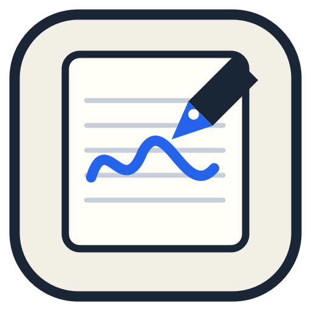
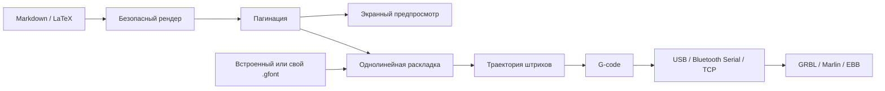

  

  # OpenHand

  **Приложение для подготовки рукописных конспектов и отправки на перьевой плоттер**

  
  
  
  
  

  Интерфейс и встроенные шрифты работают локально.

---

## Что такое OpenHand

OpenHand — это студия рукописных документов и полноценное рабочее место для перьевого плоттера. Вы пишете привычный Markdown или LaTeX, настраиваете характер почерка, раскладываете материал по страницам и сразу видите результат.

Когда макет готов, его можно распечатать, сохранить в PDF, преобразовать в G-code или отправить на совместимый плоттер прямо из приложения. Для действительно персонального результата в проект встроена студия однолинейных `.gfont`‑шрифтов: символы можно нарисовать вручную или импортировать с фотографии заполненного бланка.

> OpenHand моделирует варианты глифов, связность букв, наклон, ритм, давление, дрейф строк, редкие исправления и даже постепенную усталость почерка.

## Возможности

| Область | Что умеет OpenHand |
| --- | --- |
| **Редактор** | Markdown и LaTeX, формулы, списки, изображения, SVG, DXF, векторизация фото и импорт таблиц XLSX/CSV/TSV |
| **Живой предпросмотр** | Автоматическая пагинация, масштабирование, одиночные страницы и развороты |
| **Форматы листа** | A4, A5, Letter и тетрадный разворот; книжная и альбомная ориентация |
| **Почерк** | Десятки локальных экранных шрифтов, кириллица, смешивание шрифтов и воспроизводимая случайность |
| **Натурализация** | Варианты букв, соединения, давление, наклон, ритм, неровность строки, исправления и усталость |
| **Ручная вёрстка** | Перетаскивание и размещение блоков непосредственно на странице |
| **Свои шрифты** | Рисование символов, импорт `.gfont`, создание почерка по фотографии и экспорт готового шрифта |
| **Плоттер** | Однолинейные шрифты, пресеты KDraw/Ozon, преобразование координат, оптимизация холостого хода и G-code |
| **Управление устройством** | USB/Bluetooth Serial и TCP; GRBL, Marlin и EBB; jog, homing, ноль, перо, консоль, пауза и аварийная остановка |
| **Надёжность** | Автосохранение в браузере и безопасное продолжение прерванного задания с контрольной точки |
| **Экспорт** | Печать/PDF, исходный документ, настройки, `.gfont` и `.gcode` |
| **Desktop** | Нативные оболочки для Windows и macOS, прямой доступ к плоттеру и отдельный просмотрщик G-code |

## Видео

## Как создать рукописный документ

1. Выберите режим **MD** или **TeX** в верхней части редактора.
2. Введите или импортируйте исходный текст.
3. Выберите экранный рукописный шрифт либо однолинейный шрифт плоттера.
4. Настройте размер листа, поля, кегль и межстрочное расстояние.
5. Подберите профиль автора и интенсивность естественных вариаций.
6. Проверьте страницы в предпросмотре; при необходимости включите ручную раскладку.
7. Распечатайте результат, сохраните его в PDF или подготовьте задание для плоттера.

## Почему почерк выглядит живым

OpenHand применяет вариации детерминированно: одинаковый текст с одинаковым `seed` даёт одинаковый результат. Макет не «прыгает» при каждом обновлении, но его можно осознанно перегенерировать.

Доступны:

- профили характера почерка;
- авторский наклон и ширина букв;
- вариативность формы повторяющихся глифов;
- контекстные соединения соседних букв;
- живой ритм и отклонение базовой линии;
- изменение давления пера;
- случайный наклон слов и межбуквенный интервал;
- нерегулярные отступы и дрейф строк;
- редкие естественные зачёркивания;
- эффект усталости на длинных документах;
- смешивание нескольких совместимых шрифтов;
- отчёт о натуральности и автоматическая коррекция настроек.

## Страницы и ручная вёрстка

OpenHand рассчитывает страницы автоматически с учётом:

- формата и ориентации бумаги;
- верхнего, нижнего и боковых полей;
- отдельного поля для чётных страниц;
- ширины текстовой колонки;
- размера шрифта и высоты строки;
- книжной пагинации и тетрадных разворотов.

Если автоматического потока недостаточно, блоки можно разместить вручную на странице. Позиции сохраняются вместе с локальным состоянием документа.

## Студия собственного почерка

### Три способа создать шрифт

1. **Нарисовать на экране.** Выберите символ и проведите его штрихи на холсте.
2. **Импортировать отдельную фотографию.** Сфотографируйте символ — OpenHand очистит изображение и превратит линию в траекторию.
3. **Заполнить печатный бланк.** Скачайте SVG‑шаблон, заполните символы от руки, сфотографируйте лист и импортируйте его целиком.

Студия содержит группы кириллицы, латиницы, цифр и знаков, показывает прогресс заполнения, хранит черновик в `localStorage`, поддерживает отмену и живой предпросмотр. Результат экспортируется в компактный однолинейный формат `.gfont`.

## Работа с плоттером

### Поддерживаемые профили контроллера

| Профиль | Типичные устройства | Особенности |
| --- | --- | --- |
| **GRBL** | CNC/XY‑плоттеры на GRBL | Стандартные координаты, realtime pause/resume и аварийный reset |
| **Marlin** | 3D‑принтеры и самодельные плоттеры | Управление пером через servo или ось Z |
| **EBB** | EiBotBoard / AxiDraw‑подобные устройства | Команды EBB и конфигурация в шагах |

Для плоттеров, которые поставляются с KDraw, предусмотрены готовые пресеты GRBL, Marlin и EBB. Пресет **Ozon / KDraw GRBL** использует исходные параметры KDraw: `115200 8N1`, скорость рисования `1500`, скорость jog `2500`, servo up/down `12000/18000`, начало координат слева сверху и возврат в ноль после задания. Размер рабочей области нужно сверить со своей моделью до первого запуска.

### Подключение

1. Подключите устройство по USB либо предварительно создайте Bluetooth COM‑порт в системе. Для сетевого модуля в приложении macOS/Windows можно выбрать TCP и указать IP/порт.
2. Выберите готовый пресет KDraw/Ozon или настройте профиль контроллера вручную.
3. Нажмите **«Выбрать USB/Bluetooth‑порт»** и подтвердите устройство в системном диалоге либо подключитесь к TCP‑адресу.
4. Маленьким шагом проверьте перемещение по X/Y.
5. Настройте безопасные позиции поднятого и опущенного пера.
6. Установите начало координат.
7. Проверьте траекторию и отсутствующие глифы.
8. Только после проверки запустите задание.

> [!CAUTION]
> Первый тест выполняйте с поднятым пером, на минимальной скорости и с малым шагом перемещения. Держите питание устройства и аварийную остановку в пределах досягаемости. Неверные пределы осей, координата Z или угол сервопривода могут повредить механику.

### Что предусмотрено для безопасной работы

- явное подключение выбранного пользователем USB‑порта;
- ручная проверка осей и пера;
- пауза, продолжение и остановка;
- журнал входящих и исходящих команд;
- ожидание подтверждения контроллера после каждой команды;
- таймаут ответа устройства;
- сохранение безопасных точек восстановления;
- отказ от восстановления, если текст, настройки или профиль изменились;
- отчёт об отсутствующих в шрифте символах;
- обнаружение объектов, выходящих за границы листа;
- проверка реальной рабочей области после преобразования начала координат и осей;
- локальный импорт G-code с ограничениями размера и блокировкой опасных команд нагрева, сброса и записи прошивки;
- опциональная оптимизация холостой траектории.

### Поток данных

## Команды разработки

| Команда | Назначение |
| --- | --- |
| `npm run dev` | Запустить Vite dev server на всех интерфейсах |
| `npm run typecheck` | Проверить TypeScript без генерации файлов |
| `npm run build` | Собрать сайт, синхронизировать macOS и упаковать приложение для текущей ОС |
| `npm run build:web` | Собрать только прод версию сайта в `docs/` |
| `npm run macos:sync` | Собрать web и перенести ресурсы в macOS‑проект |
| `npm run macos:build` | Собрать универсальный `OpenHand.app` на macOS |
| `npm run windows:build` | Собрать автономный Windows x64 release и ZIP в `windows/build/` |
| `npm run windows:build:arm64` | Собрать автономный Windows ARM64 release и ZIP |

### Windows

Windows-порт находится в `windows/` и использует WinForms, WebView2 и нативный
мост к последовательному порту или локальному TCP‑устройству. Он поддерживает те
же скорости, формат порта и сигналы управления, что macOS-оболочка, системное
сохранение экспортов, перетаскивание и открытие `.gcode`, `.nc` и `.tap`.

Для разработки нужен .NET 8 SDK. Готовая self-contained сборка не требует
отдельной установки .NET, но использует системный Microsoft Edge WebView2
Runtime, который входит в актуальные Windows 10 и Windows 11.

## Частые вопросы

<strong>Текст отправляется на сервер?</strong>

Основной редактор, рендеринг, шрифты и расчёт траектории работают локально. Черновики сохраняются в хранилище браузера. При использовании размещённой версии сервер, конечно, отдаёт статические файлы приложения, но содержимое документа не требуется отправлять backend OpenHand.

<strong>Почему браузер не показывает USB‑порт?</strong>

Web Serial поддерживается в Chromium‑браузерах на desktop и требует безопасного контекста: HTTPS или `localhost`. Используйте актуальный Chrome/Edge, проверьте кабель и убедитесь, что порт не занят другой программой.

<strong>Почему часть букв отсутствует на траектории?</strong>

У выбранного `.gfont` нет нужных глифов. Проверьте список пропущенных символов, выберите более полный встроенный шрифт либо дополните собственный в Студии шрифтов.

<strong>Можно ли получить PDF?</strong>

Да. Откройте печать из приложения и выберите системный принтер «Сохранить как PDF». Специальные стили печати уберут элементы интерфейса и оставят страницы документа.

<strong>Можно ли пользоваться без плоттера?</strong>

Да. Редактор рукописных страниц, LaTeX, формулы, пагинация, PDF и Студия шрифтов работают независимо от физического устройства.

<strong>Почему результат меняется при смене seed?</strong>

Seed управляет воспроизводимой псевдослучайностью почерка. Одинаковые исходник, настройки и seed дают одинаковую раскладку; новое значение создаёт другой естественный вариант.

## Ахтунг!

**OpenHand — проприетарное программное обеспечение. Все права защищены.**

Исходный код опубликован исключительно для ознакомления, оценки и прозрачности. Без предварительного письменного разрешения правообладателя запрещены:

- копирование и распространение;
- изменение и создание производных работ;
- самостоятельная сборка, установка и размещение;
- продажа, аренда и иная монетизация;
- коммерческое и производственное использование;
- предоставление программы как сервиса;
- включение кода в другие продукты, проекты, датасеты или обучающие наборы;
- использование названия, логотипа и фирменного оформления.

Разрешены просмотр исходников в ознакомительных целях и использование неизменённой официальной версии, предоставленной правообладателем. Полные юридические условия находятся в файле [LICENSE](./LICENSE).

Отдельные сторонние шрифты, библиотеки и исходные материалы сохраняют собственные лицензии. Лицензия OpenHand применяется только к правам, принадлежащим автору проекта.

[Открыть OpenHand](https://renothingg.github.io/OpenHand)
·
[Сообщить о проблеме](https://github.com/ReNothingg/OpenHand/issues)
·
[Предложить идею](https://github.com/ReNothingg/OpenHand/issues/new)

Если проект оказался полезен, поставьте ⭐

