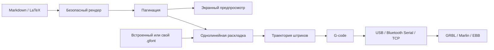

  

  # OpenHand

  **Приложение для подготовки рукописных конспектов и отправки на перьевой плоттер**

  
  
  
  
  

  Интерфейс и встроенные шрифты работают локально.

---

## Что такое OpenHand

OpenHand — это студия рукописных документов и полноценное рабочее место для перьевого плоттера. Вы пишете привычный Markdown или LaTeX, настраиваете характер почерка, раскладываете материал по страницам и сразу видите результат.

Когда макет готов, его можно распечатать, сохранить в PDF, преобразовать в G-code или отправить на совместимый плоттер прямо из приложения. Для действительно персонального результата в проект встроена студия однолинейных `.gfont`‑шрифтов: символы можно нарисовать вручную или импортировать с фотографии заполненного бланка.

> OpenHand моделирует варианты глифов, связность букв, наклон, ритм, давление, дрейф строк, редкие исправления и даже постепенную усталость почерка.

## Возможности

| Область | Что умеет OpenHand |
| --- | --- |
| **Редактор** | Markdown и LaTeX, формулы, списки, изображения, SVG, DXF, векторизация фото и импорт таблиц XLSX/CSV/TSV |
| **Живой предпросмотр** | Автоматическая пагинация, масштабирование, одиночные страницы и развороты |
| **Форматы листа** | A4, A5, Letter и тетрадный разворот; книжная и альбомная ориентация |
| **Почерк** | Десятки локальных экранных шрифтов, кириллица, смешивание шрифтов и воспроизводимая случайность |
| **Натурализация** | Варианты букв, соединения, давление, наклон, ритм, неровность строки, исправления и усталость |
| **Ручная вёрстка** | Перетаскивание и размещение блоков непосредственно на странице |
| **Свои шрифты** | Рисование символов, импорт `.gfont`, создание почерка по фотографии и экспорт готового шрифта |
| **Плоттер** | Однолинейные шрифты, пресеты KDraw/Ozon, преобразование координат, оптимизация холостого хода и G-code |
| **Управление устройством** | USB/Bluetooth Serial и TCP; GRBL, Marlin и EBB; jog, homing, ноль, перо, консоль, пауза и аварийная остановка |
| **Надёжность** | Автосохранение и продолжение прерванного задания с подтверждённой контрольной точки |
| **Экспорт** | Печать/PDF, исходный документ, настройки, `.gfont` и `.gcode` |
| **Desktop** | Нативные оболочки для Windows и macOS, прямой доступ к плоттеру и отдельный просмотрщик G-code |

## Видео

## Как создать рукописный документ

1. Выберите режим **MD** или **TeX** в верхней части редактора.
2. Введите или импортируйте исходный текст.
3. Выберите экранный рукописный шрифт либо однолинейный шрифт плоттера.
4. Настройте размер листа, поля, кегль и межстрочное расстояние.
5. Подберите профиль автора и интенсивность естественных вариаций.
6. Проверьте страницы в предпросмотре; при необходимости включите ручную раскладку.
7. Распечатайте результат, сохраните его в PDF или подготовьте задание для плоттера.

## Почему почерк выглядит живым

OpenHand применяет вариации детерминированно: одинаковый текст с одинаковым `seed` даёт одинаковый результат. Макет не «прыгает» при каждом обновлении, но его можно осознанно перегенерировать.

Доступны:

- профили характера почерка;
- авторский наклон и ширина букв;
- вариативность формы повторяющихся глифов;
- контекстные соединения соседних букв;
- живой ритм и отклонение базовой линии;
- изменение давления пера;
- случайный наклон слов и межбуквенный интервал;
- нерегулярные отступы и дрейф строк;
- редкие естественные зачёркивания;
- эффект усталости на длинных документах;
- смешивание нескольких совместимых шрифтов;
- отчёт о натуральности и автоматическая коррекция настроек.

## Страницы и ручная вёрстка

OpenHand рассчитывает страницы автоматически с учётом:

- формата и ориентации бумаги;
- верхнего, нижнего и боковых полей;
- отдельного поля для чётных страниц;
- ширины текстовой колонки;
- размера шрифта и высоты строки;
- книжной пагинации и тетрадных разворотов.

Если автоматического потока недостаточно, блоки можно разместить вручную на странице. Позиции сохраняются вместе с локальным состоянием документа.

## Студия собственного почерка

### Три способа создать шрифт

1. **Нарисовать на экране.** Выберите символ и проведите его штрихи на холсте.
2. **Импортировать отдельную фотографию.** Сфотографируйте символ — OpenHand очистит изображение и превратит линию в траекторию.
3. **Заполнить печатный бланк.** Скачайте SVG‑шаблон, заполните символы от руки, сфотографируйте лист и импортируйте его целиком.

Студия содержит группы кириллицы, латиницы, цифр и знаков, показывает прогресс заполнения, хранит черновик в `localStorage`, поддерживает отмену и живой предпросмотр. Результат экспортируется в компактный однолинейный формат `.gfont`.

## Работа с плоттером

### Запись по листам и начало ниже готовых записей

Перетащите стрелку за внешним краем листа к нужной строке или на другую
страницу. У края области предпросмотра включается автопрокрутка. Текст
переразмещается после отпускания стрелки. Предыдущие страницы остаются
пустыми. Отступ действует только на стартовой странице: все следующие,
включая новый лист после переворота бумаги, начинаются с обычного верхнего поля.
Page Up / Page Down или стрелки влево/вправо меняют страницу; вверх/вниз —
высоту на 1 мм (с Shift — 10 мм). Двойной щелчок возвращает начало документа.
Указатель и подсказка при перетягивании не попадают в печать и G-code.

Внизу выберите **«Текущий лист»** или **«С текущего до конца»**, проверьте
нулевую точку и перо, затем нажмите **«Начать запись»**. Для очереди GRBL/Marlin
после каждого листа приложение поднимает перо и ждёт завершения движений.
Далее появляется окно **«Смените лист»**: закрепите бумагу по прежнему
нулю, подтвердите это галочкой и нажмите **«Продолжить»**. Для разворота пауза
наступает после обеих страниц. После последнего листа приходит уведомление
о завершении, без запроса переворота.

Кнопка **«Уведомления»** запрашивает разрешение на системные
уведомления; при отказе окно смены бумаги всё равно работает внутри приложения.
В macOS используются системные уведомления и привлечение внимания к приложению,
в Windows — уведомление в области уведомлений. Во время очереди документ,
настройки и линия заблокированы, чтобы следующие листы соответствовали
подготовленному заданию. Обрыв связи, авария или остановка отменяют очередь;
самостоятельно после переподключения она не возобновляется.
После обрыва связи сохраняется подтверждённая точка и выбор листов. Это работает
и для обычной записи одного листа, и для очереди. Кнопка продолжения показывает
нужный лист; при изменении задания или выбора листов старое продолжение отклоняется.
Если обрыв произошёл между листами, восстановление сначала завершает подъём пера
из подтверждённого положения и снова запрашивает смену бумаги. Следующий лист
не пишется до подтверждения. СТОП удаляет продолжение отменённой очереди, а
«Сбросить прогресс» очищает счётчики без команд плоттеру.
Для EBB пока остаётся запуск одного листа без автоматической очереди.

### Мастерская траекторий

В верхней навигации выберите **«Мастерская плоттера»**. Здесь можно создать
фигуры, импортировать HPGL/PLT или CSV координат, перенести штрихи текущего
документа, изменить размер и поворот, отразить рисунок, добавить штриховку
или сетку повторов. Проект сохраняется локально и в JSON; доступны SVG и
G-code экспорт, отмена и повтор изменений. Настройка подключения находится
во вкладке **«Устройство»**, запуск — под холстом.

В GRBL 1.1 отображаются реальные координаты и доступны изменения подачи
и холостого хода. Нативное меню **«Рабочее пространство»** открывает документ
и мастерскую через Cmd+Shift+1/2 на macOS или Ctrl+Shift+1/2 на Windows.
Просмотрщик G-code также поддерживает редактирование и сохранение файла.

Поддержка HPGL ограничена геометрическими командами для одного пера; скорость
и механизм пера берутся из профиля. CSV координат содержит `x,y` в миллиметрах,
пустая строка отделяет штрихи. Рисунок ограничен 100 000 точками.

Полное покрытие GRBL-Plotter, ограничения и ещё не перенесённые функции
перечислены в [карте возможностей](notes/grbl-plotter-coverage.md).

### Поддерживаемые профили контроллера

| Профиль | Типичные устройства | Особенности |
| --- | --- | --- |
| **GRBL** | CNC/XY‑плоттеры на GRBL | Стандартные координаты, realtime pause/resume и аварийный reset |
| **Marlin** | 3D‑принтеры и самодельные плоттеры | Управление пером через servo или ось Z |
| **EBB** | EiBotBoard / AxiDraw‑подобные устройства | Команды EBB и конфигурация в шагах |

Для плоттеров, которые поставляются с KDraw, предусмотрены готовые пресеты GRBL, Marlin и EBB. Пресет **Ozon 2121931195 · GRBL Stepper** использует `115200 8N1`, шаговый подъём `Z0/Z3` со скоростью `1000`, проверенные для этого устройства направления `X+ вниз / Y+ вправо` и ноль слева сверху. Перед первой командой пера нужно явно зафиксировать поднятую высоту: `G92 Z0` не двигает механизм. Размеры рабочей области измеряются от выбранного угла нуля; мастер не отправляет каретку на непроверенные края. Подробности статического разбора KDraw — в [KDRAW_PROTOCOL.md](KDRAW_PROTOCOL.md).

### Единые настройки устройства

В верхней навигации откройте **Плоттер**. Профиль и соединение общие для документа
и мастерской. Для настройки шагового пера выбирается шаг 0,1 / 0,25 / 0,5 / 1 мм.
Он сохраняется в профиле; смена шага не двигает механизм. Кнопки «Выше / Ниже»
выполняют одно относительное движение на низкой скорости и показывают его размер.
Кнопки «Сохранить как верхнее / нижнее» запоминают текущую
отметку; одинаковые положения не принимаются. Направление подъёма хранится отдельно
от высот и не меняется при сохранении точки. Письмо и рамка недоступны до сохранения
двух разных положений. Изменение параметров, относящихся к проверенной позиции,
снимает её подтверждение.

«Сбросить настройку пера» очищает только сохранённые положения в приложении,
не посылая команд устройству. Это не аварийная остановка. «Начать настройку здесь»
задаёт текущую отметку Z/E командой G92 без движения. После утраты опорной точки
сохранённой пары доступны «В сохранённой верхней / нижней точке». Это означает
точное совпадение с сохранённой высотой, а не просто нахождение над бумагой.

Красная **СТОП** в общей панели и **Esc** отменяют очередь и отправляют контроллеру
остановку вне ожидания `ok`. Новые команды заблокированы до явного разрешения;
оно само не отправляет команды и не возобновляет задание. Надпись об отправке
не является доказательством физической остановки. При недоступной связи необходимо
отключить питание и USB. На GRBL используются jog-cancel, feed-hold и soft-reset.

В нативной оболочке версии 4 и новее при активном соединении Esc обрабатывается также
самой оболочкой, включая системное окно выбора файла. В меню «Плоттер» есть
«СТОП — отменить движения» (⌘. на macOS, Ctrl+. на Windows). Нативная отправка
не ждёт выполнения JavaScript; интерфейс присоединяется к той же операции
и отменяет свою очередь, не отправляя повторный сброс.

В версии 5 обычное закрытие окна и выход из приложения сначала блокируют новые
команды, отправляют СТОП активному соединению и лишь затем закрывают порт. При
ошибке или истечении четырёх секунд приложение остаётся открытым. Без активного
соединения сохранённый USB-порт ради выхода не открывается. Принудительное
завершение процесса и отключение компьютера не проходят через этот обработчик.

Нативная оболочка версии 6 не допускает два соединения OpenHand с одним USB-портом.
На macOS перед настройкой проверяется и владелец уже открытого порта, включая старую
копию приложения из Xcode; для найденного владельца показываются имя процесса и PID. Блокировка
освобождается при закрытии или завершении процесса. На Windows занятой или недоступный
порт также получает отдельное понятное сообщение. Причина ошибки передачи СТОП
показывается в его уведомлении, а не только в журнале.

Приложение не меняет `$1` автоматически. Ранее включённое удержание `$1=255`
было отменено при диагностике конкретного устройства и восстановлено `$1=25`.

### Запуск задания

Для ручной установки не нужно проходить мастер калибровки:

1. Поставьте поднятое перо над левым верхним углом листа.
2. В документе или мастерской нажмите **«Начало листа здесь»**. Кнопка без движения
   задаёт только ноль XY. Она не перемещает перо и не назначает его вертикальную опорную точку.
   Началом листа в профиле становится левый верхний угол; направления осей сохраняются.
3. Нажмите **«Начать запись»** или **«Начать рисунок»**. Поля документа остаются в силе.

Две высоты пера настраиваются один раз и сохраняются в общем профиле. Мастер
направлений остаётся дополнительным инструментом, а его прохождение больше не
блокирует запись и ручные стрелки. Ограничения размера рисунка и настроенные
направления осей продолжают применяться. Если вертикальная опорная точка потеряна,
задание не запускается, пока она не восстановлена отдельно. После упора в механику
или ручного изменения высоты нельзя считать прежнюю вертикальную точку достоверной.

Рядом с запуском и в настройке показано расчётное время одного подъёма/опускания.
Например, ход 7 мм при скорости 1 мм/мин занимает около 7 минут. Расчёт задания
учитывает оба вертикальных хода каждого штриха. Для GRBL генератор явно задаёт G94
(единицы в минуту); значение скорости из профиля автоматически не увеличивается.

Явная установка начала листа и опорной высоты, задания, рамка и возврат используют
одну рабочую систему GRBL: G54, плоскость XY, без коррекции длины инструмента (G49).
Выбор этих режимов не перемещает оси; координата Z назначается только отдельным
действием настройки пера. При подключении эти команды не отправляются.

Создаваемые приложением перемещения над листом, рамка и возврат к нулю используют
G1 с заданной скоростью холостого хода. Ранее G0 не ограничивался указанным рядом F
в GRBL. Загруженные файлы и пользовательские команды не переписываются.

Экспорт из документа, мастерской и пробного листа содержит комментарий с параметрами
пера для предпросмотра. Он позволяет различать штрихи и холостой ход при обеих
ориентациях Z, для шагового E и сервопривода. Комментарий не отправляется в составе
очереди и не разрешает выполнение файла. Файлы без этих данных помечаются как
приблизительные по состоянию пера; проверка отправки использует настройки устройства.

Документ, мастерская, пробный лист, импорт и продолжение используют одну проверку
соединения, состояния Idle, нуля листа и сохранённых положений пера. Дополнительной
галочки готовности нет: кнопка запуска доступна после фактической подготовки.
При блокировке показана причина и переход к настройкам устройства.

В мастерской есть отдельное **«Продолжить рисунок»**. Оно использует подтверждённую
точку именно текущего рисунка. Если незавершённое задание относится к другому
рабочему пространству, показывается переход к нему. Изменившаяся траектория не
возобновляется со старого индекса. Пробный лист настройки и произвольный импорт
не возобновляются автоматически по сохранённому индексу.

При импорте тело файла остаётся неизменным. Приложение отдельно проверяет подготовку
с поднятием пера и завершение с подъёмом; всё выполняется под одним владельцем
очереди. После ошибки или СТОП завершающий подъём не отправляется. Обычное окончание
подтверждается только после выполнения завершающих команд. Стандартные G54/G49/G40
допустимы для GRBL; другие рабочие системы, G92 и изменение длины инструмента из
файла блокируются. M30 обрабатывается как завершение только у GRBL: в Marlin это
команда удаления файла с SD-карты, поэтому её отправка из импортированного задания
не разрешена.

Перед отправкой проверяется именно тот набор команд, который будет выполнен,
включая пользовательские команды до/после задания. Автоматическое обнуление перед
заданием отключено; начало листа задаётся явно. Непроверяемый G-code можно просмотреть,
но нельзя отправить: системные команды, неизвестные движения, смена координатной
системы и выход за сохранённые высоты пера блокируют запуск. Границы импорта учитывают
выбранные оси и угол нуля, а не только абсолютную величину координат.

Проверка направлений и сохранённые высоты связаны со снимком параметров GRBL.
Переподключение к той же конфигурации сохраняет проверку; изменение шагов, направлений,
ограничений или режима удержания снимает подтверждение затронутой настройки.
Изменение параметров пера требует заново сохранить его высоты; мастер осей необязателен.
Профиль из файла переносит числа, но не подтверждает физическую проверку этого устройства.
Обычное сохранение и загрузка профиля самим приложением сохраняют подтверждения.

### Диагностика

Во вкладке «Плоттер» раздел **«Диагностика и версия приложения»** показывает дату
сборки, исходную ревизию и версию нативного USB-моста. Кнопка **«Сохранить диагностику»**
создаёт локальный JSON с профилем устройства, состоянием соединения и журналом ответов,
без текста документа. Устаревшая нативная оболочка не допускается к новому протоколу
управления: требуется полностью закрыть приложение и запустить актуальную сборку.

СТОП блокирует обычную запись также в нативном мосте. Повторные нажатия объединяются
в одну текущую операцию; старый запрос разблокировки не отменяет более новый СТОП.
При неполной записи канал считается рассинхронизированным, дальнейшее движение запрещено.
После сброса координаты не отображаются как миллиметры, пока не прочитана настройка единиц.

### Подключение

1. Подключите устройство по USB либо предварительно создайте Bluetooth COM‑порт в системе. Для сетевого модуля в приложении macOS/Windows можно выбрать TCP и указать IP/порт.
2. Выберите готовый пресет KDraw/Ozon или настройте профиль контроллера вручную.
3. Нажмите **«Выбрать USB/Bluetooth‑порт»** и подтвердите устройство в системном диалоге либо подключитесь к TCP‑адресу.
4. Маленьким шагом проверьте перемещение по X/Y.
5. Настройте безопасные позиции поднятого и опущенного пера.
6. Установите начало координат.
7. Проверьте траекторию и отсутствующие глифы.
8. Только после проверки запустите задание.

> [!CAUTION]
> Первую проверку выполняйте с поднятым пером и малым шагом перемещения; учитывайте показанное время хода при выбранной скорости. Держите питание устройства и аварийную остановку в пределах досягаемости. Неверные пределы осей, координата Z или угол сервопривода могут повредить механику.

### Что предусмотрено для безопасной работы

- явное подключение выбранного пользователем USB‑порта;
- ручная проверка осей и пера;
- пауза, продолжение и остановка;
- журнал входящих и исходящих команд;
- ожидание подтверждения контроллера после каждой команды;
- таймаут ответа устройства;
- сохранение подтверждённых контроллером точек восстановления;
- отказ от восстановления, если текст, настройки или профиль изменились;
- отчёт об отсутствующих в шрифте символах;
- обнаружение объектов, выходящих за границы листа;
- проверка реальной рабочей области после преобразования начала координат и осей;
- локальный импорт G-code с ограничениями размера и блокировкой опасных команд нагрева, сброса и записи прошивки;
- опциональная оптимизация холостой траектории.

### Поток данных

## Команды разработки

| Команда | Назначение |
| --- | --- |
| `npm run dev` | Запустить Vite dev server на всех интерфейсах |
| `npm run typecheck` | Проверить TypeScript без генерации файлов |
| `npm run build` | Собрать сайт, синхронизировать macOS и упаковать приложение для текущей ОС |
| `npm run build:web` | Собрать только прод версию сайта в `docs/` |
| `npm run macos:sync` | Собрать web и перенести ресурсы в macOS‑проект |
| `npm run macos:build` | Собрать универсальный `OpenHand.app` на macOS |
| `npm run windows:build` | Собрать автономный Windows x64 release и ZIP в `windows/build/` |
| `npm run windows:build:arm64` | Собрать автономный Windows ARM64 release и ZIP |

### Windows

Windows-порт находится в `windows/` и использует WinForms, WebView2 и нативный
мост к последовательному порту или локальному TCP‑устройству. Он поддерживает те
же скорости, формат порта и сигналы управления, что macOS-оболочка, системное
сохранение экспортов, перетаскивание и открытие `.gcode`, `.nc` и `.tap`.

Для разработки нужен .NET 8 SDK. Готовая self-contained сборка не требует
отдельной установки .NET, но использует системный Microsoft Edge WebView2
Runtime, который входит в актуальные Windows 10 и Windows 11.

## Частые вопросы

<strong>Текст отправляется на сервер?</strong>

Основной редактор, рендеринг, шрифты и расчёт траектории работают локально. Черновики сохраняются в хранилище браузера. При использовании размещённой версии сервер, конечно, отдаёт статические файлы приложения, но содержимое документа не требуется отправлять backend OpenHand.

<strong>Почему браузер не показывает USB‑порт?</strong>

Web Serial поддерживается в Chromium‑браузерах на desktop и требует безопасного контекста: HTTPS или `localhost`. Используйте актуальный Chrome/Edge, проверьте кабель и убедитесь, что порт не занят другой программой.

<strong>Почему часть букв отсутствует на траектории?</strong>

У выбранного `.gfont` нет нужных глифов. Проверьте список пропущенных символов, выберите более полный встроенный шрифт либо дополните собственный в Студии шрифтов.

<strong>Можно ли получить PDF?</strong>

Да. Откройте печать из приложения и выберите системный принтер «Сохранить как PDF». Специальные стили печати уберут элементы интерфейса и оставят страницы документа.

<strong>Можно ли пользоваться без плоттера?</strong>

Да. Редактор рукописных страниц, LaTeX, формулы, пагинация, PDF и Студия шрифтов работают независимо от физического устройства.

<strong>Почему результат меняется при смене seed?</strong>

Seed управляет воспроизводимой псевдослучайностью почерка. Одинаковые исходник, настройки и seed дают одинаковую раскладку; новое значение создаёт другой естественный вариант.

## Ахтунг!

**OpenHand — проприетарное программное обеспечение. Все права защищены.**

Исходный код опубликован исключительно для ознакомления, оценки и прозрачности. Без предварительного письменного разрешения правообладателя запрещены:

- копирование и распространение;
- изменение и создание производных работ;
- самостоятельная сборка, установка и размещение;
- продажа, аренда и иная монетизация;
- коммерческое и производственное использование;
- предоставление программы как сервиса;
- включение кода в другие продукты, проекты, датасеты или обучающие наборы;
- использование названия, логотипа и фирменного оформления.

Разрешены просмотр исходников в ознакомительных целях и использование неизменённой официальной версии, предоставленной правообладателем. Полные юридические условия находятся в файле [LICENSE](./LICENSE).

Отдельные сторонние шрифты, библиотеки и исходные материалы сохраняют собственные лицензии. Лицензия OpenHand применяется только к правам, принадлежащим автору проекта.

[Открыть OpenHand](https://renothingg.github.io/OpenHand)
·
[Сообщить о проблеме](https://github.com/ReNothingg/OpenHand/issues)
·
[Предложить идею](https://github.com/ReNothingg/OpenHand/issues/new)

Если проект оказался полезен, поставьте ⭐

### Сокращение команд плоттера

В настройках плоттера включено «Ускорить обработку траектории»: лишние точки
удаляются с максимальным отклонением 0,02 мм в координатах станка. Концы
штрихов, их порядок, давление, заданные скорости и задержки пера сохраняются.
Для точного воспроизведения всех исходных точек отключите эту настройку.
Выигрыш во времени зависит от плотности траектории и контроллера; расчётное
время не учитывает все задержки связи и ускорения двигателей.

### PNG, JPG и WebP в мастерской

В разделе «Рисунок» нажмите «Изображение PNG / JPG» или перетащите файл на холст.
По умолчанию фон и тени отделяются автоматически с учётом цвета. При необходимости
выберите «Ручной порог». Настройте ширину в
миллиметрах. Сравните оригинал и линии, затем нажмите «Добавить в рисунок».
Изображения обрабатываются локально; максимальный файл — 16 МБ. Прозрачность
считается белым фоном. Режим «Контуры» сохраняет внешние границы и отверстия;
«Осевые линии» предназначен для штриховых рисунков. Импорт лучше
подходит для контурных рисунков. После добавления доступны обычные
преобразования, экспорт G-code и запуск после проверки устройства.

### Редактор сцены мастерской

Каждая картинка, импортированная траектория и добавленная фигура — отдельный
объект. Выделяйте их на холсте или в списке объектов; Shift добавляет к выделению,
рамка на пустом месте выделяет несколько объектов. Перетаскивание перемещает
выделение. Инструменты: V — перемещение, E — вращение, R — масштаб, T — Warp,
H или удержание пробела — обзор. Колесо меняет масштаб камеры под указателем.

У вращения есть круглый маркер над выделением, у масштаба и Warp — угловые
маркеры. Shift даёт шаг 1 мм при перемещении, 15° при вращении и свободные
пропорции при масштабировании. F вписывает выделение (или всю сцену), стрелки
сдвигают на 1 мм, Shift со стрелкой — на 10 мм. Ctrl/⌘D дублирует, Delete удаляет,
Ctrl/⌘Z отменяет, Ctrl/⌘Shift+Z повторяет. Escape отменяет текущее перетягивание.

G-code обновляется после отпускания маркера. Файлы проекта версии 2 сохраняют
объекты отдельно; старые проекты открываются одним объектом. Выход за рабочую
область отмечается красным, проверка перед запуском сохраняется.

Кнопка «Повернуть лист» в панели сцены меняет портретную и альбомную
ориентацию листа. Ориентация сохраняется в проекте и поддерживает отмену.
Рисунки и физические пределы станка при этом не поворачиваются автоматически;
запуск требует размещения рисунка внутри листа и рабочей области станка.
